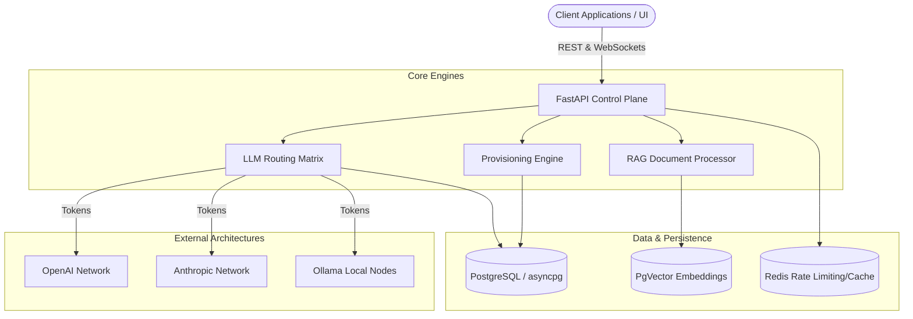

# 🪐 Agnostic Orchestration Platform (AOP)

[]()
[]()
[]()
[]()
[]()
[]()

## Overview

The **Agnostic Orchestration Platform (AOP)** is an advanced, enterprise-grade, multi-tenant AI control plane explicitly designed to seamlessly orchestrate diverse Language Models, massive Vector Databases, and complex Retrieval-Augmented Generation (RAG) workflows entirely behind a singular unified architectural API. 

Engineered strictly for scale, AOP natively handles dynamic LLM traffic routing across OpenAI, Anthropic, and Local Ollama models leveraging intelligent topological fallback matrices. It enforces rigorous organizational budget caps dynamically across isolated tenants, shields API bounds using Redis rate-limiters, and executes completely isolated Terraform/Kubernetes infrastructure deployments dynamically via its native provisioning pipeline.

## 🏗️ Architecture Design



## ✨ Core Features

- **Dynamic LLM Proxy Network**: Transparently route requests across global AI providers utilizing advanced programmatic heuristics (Cost Optimized, Latency Optimized, or Round-Robin) equipped natively with failover Circuit Breakers.
- **Massive RAG & Vector Management**: End-to-end multi-modal ingestion pipeline (PDF, HTML, DOCX) executing fast NLP topologies and committing geometric arrays dynamically into robust `pgvector` B-Trees.
- **Strict Multi-Tenant Governance**: Enforces tight architectural boundaries utilizing cryptographic API Keys natively mapping to active 30-day USD Budget Caps, isolating spend tracking granularly.
- **Telemetry & Alert Monitoring**: Exposed native `/metrics` endpoints optimized for Prometheus logic, alongside dynamic Webhook abstractions parsing critical constraints across Slack and PagerDuty endpoints.
- **WebSocket Synchronization**: Centralized sub-second push mechanics bypassing HTTP polling, delivering active system heartbeat diagnostics flawlessly to isolated React Dashboards.
- **Blistering Asynchronous SQL Execution**: Heavily leverages SQLalchemy 2.0 `asyncpg` execution loops interacting with highly complex SQL `JSONB` indexes inside PostgreSQL yielding zero pipeline blocks.

## 🚀 Quick Start

Ensure you have Docker and Docker Compose actively mounted on your operational environment.

```bash
# 1. Clone the physical repository
git clone https://github.com/organization/aop.git
cd aop

# 2. Boot the clustered topology natively
docker-compose up --build -d

# 3. Observe deployment network arrays
docker-compose logs -f
```
_The API Gateway will instantly become accessible across TCP boundary: `http://localhost:8000`._

## 📚 API Documentation

Once the logical cluster is actively running locally, the unified OpenAPI endpoints structurally map explicit schemas natively yielding beautiful interactive explorers:
- **Swagger UI**: [http://localhost:8000/docs](http://localhost:8000/docs)
- **ReDoc UI**: [http://localhost:8000/redoc](http://localhost:8000/redoc)

## 💻 Technology Stack

| Domain | Architecture Logic |
| :--- | :--- |
| **Control Plane Core** | Python 3.11, FastAPI, Pydantic v2, Uvicorn |
| **Frontend Interface** | React 18, TypeScript, TailwindCSS, React Router |
| **Relational Storage** | PostgreSQL 16, SQLAlchemy 2.0 (asyncpg), Alembic |
| **Vector Native Engine** | PostgreSQL (`pgvector`) |
| **PubSub & Rate Limits** | Redis 7 |
| **Infrastructure Pipeline** | Docker Compose |

## 📁 Project Topologies

```
AOP/
├── agnostic-ai-platform/      # AI Execution Integrations (LLM Routers, RAG Parsing)
│   └── app/
│       ├── llm/
│       ├── rag/
│       ├── monitoring/
│       └── auth/
├── control-plane/             # Global Platform Operations (Finance, Telemetry, Database)
│   ├── app/
│   │   ├── database/
│   │   ├── settings/
│   │   ├── billing/
│   │   ├── export/
│   │   ├── notifications/
│   │   ├── provisioning/
│   │   └── registry/
│   └── pyproject.toml
└── web/                       # React Frontend Interface
    ├── public/
    └── src/
```

## 🤝 Contributing

Contributions scaling the core platform logic are highly welcomed. Check out the [CONTRIBUTING.md](./CONTRIBUTING.md) integration guide for strict constraints regarding topological code structure, `ruff` linting configurations, and submitting PRs smoothly across our asynchronous execution boundaries.

## 📄 License

This monolithic platform is rigidly licensed under the MIT License constraints - refer to the [LICENSE.md](./LICENSE.md) schema mapping for explicit operational details.
